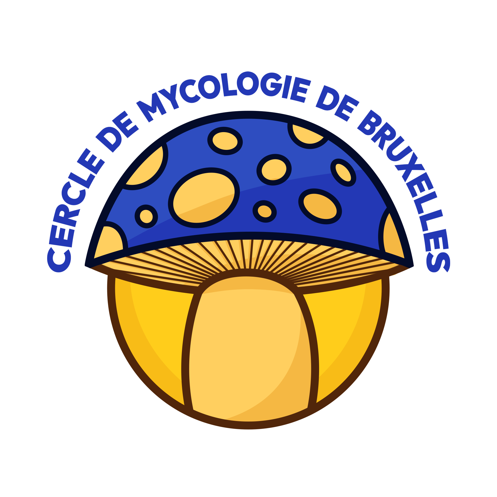

<p align="center"><a href="https://cercle-myco-bruxelles.be" target="_blank"></a></p>

# Website of *Cercle de Mycologie de Bruxelles*

This repository contains the backend code for the "*Cercle de Mycologie de Bruxelles*". The online version is available at [https://cercle-myco-bruxelles.be](https://cercle-myco-bruxelles.be).

## Backend

<p align="center"><a href="https://laravel.com" target="_blank"></a></p>

This project uses the php framework Laravel.

### Requirements

- PHP 8.2 or Higher
- Composer

### Todo after cloning the repository

#### 1 - Create the .env file

A **_.env_** file is used to configurate the environment of the application, you can use the [.env.example](./.env.example) to help you.

##### 1.1 - Generate an app key

Use the following command to generate an encryption key:

```shell
php artisan key:generate
```

#### 2 - Migrate the database

Use the following command to migrate the database:

```shell
php artisan migrate  
```

For informations about what is a migration, [see this link](https://laravel.com/docs/11.x/migrations#introduction).

### Serve

You can run a dev server by using the command:

```shell
php artisan serve
```

If it doesn't work, try:

```shell
php -S 127.0.0.1:8000 -t public
```

## Author

The author of this project is [Téo Derboven](https://github.com/teoderboven)